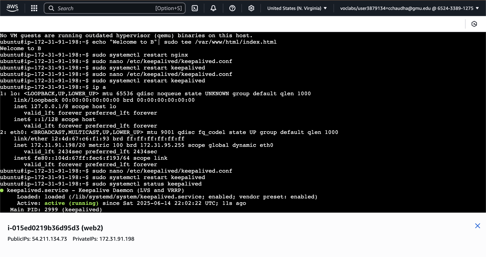
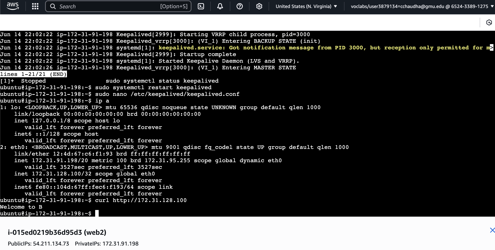
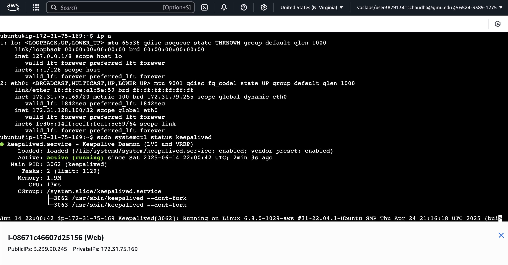

# NGINX-High-Availability-with-Keepalived-on-AWS-EC2

## Overview
This repository contains a setup for achieving high availability (HA) for NGINX web servers using Keepalived on two AWS EC2 instances. The configuration leverages a Virtual IP (VIP) managed by Keepalived to enable seamless failover between an active (master) and standby (backup) instance. The solution is deployed within an existing AWS VPC (172.31.0.0/16) with multiple subnets across different Availability Zones.

- **Master Instance**: Handles traffic via the VIP.
- **Backup Instance**: Takes over the VIP if the master fails.
- **VIP**: 172.31.128.100 (configured for HA).

## Prerequisites
- An AWS account with EC2 access.
- An existing VPC with CIDR 172.31.0.0/16 and subnets (e.g., 172.31.64.0/20, 172.31.80.0/20).
- An SSH key pair for EC2 instance access.
- Basic familiarity with Linux command line and the AWS Management Console.

## Setup Instructions

### 1. Launch EC2 Instances
- Launch two EC2 instances (e.g., Ubuntu 22.04 LTS) in the same VPC but different Availability Zones:
  - Instance A: Subnet 172.31.64.0/20 (e.g., us-east-1a).
  - Instance B: Subnet 172.31.80.0/20 (e.g., us-east-1b).
- Configure security groups to allow:
  - SSH (port 22) from your IP.
  - HTTP (port 80) for the VIP.
- Assign a key pair and note the public IPs.

### 2. Install NGINX
- Connect to each instance via SSH:
  ```bash
  ssh -i your-key.pem ubuntu@<instance-public-ip>
  ```
- Update packages and install NGINX:
  ```bash
  sudo apt update
  sudo apt install nginx -y
  ```
- Start and enable NGINX:
  ```bash
  sudo systemctl start nginx
  sudo systemctl enable nginx
  ```
- Verify with `curl http://<instance-public-ip>`.

### 3. Install Keepalived
- Install Keepalived on both instances:
  ```bash
  sudo apt install keepalived -y
  ```
- Enable Keepalived (will be configured later):
  ```bash
  sudo systemctl enable keepalived
  ```

### 4. Configure Keepalived
- **Instance A (Master)**:
  - Edit `/etc/keepalived/keepalived.conf`:
    ```plaintext
    vrrp_instance VI_1 {
        state MASTER
        interface eth0
        virtual_router_id 51
        priority 100
        advert_int 1
        authentication {
            auth_type PASS
            auth_pass devops12
        }
        virtual_ipaddress {
            172.31.128.100
        }
    }
    ```
  - Save, test with `sudo keepalived --config-test`, and restart:
    ```bash
    sudo systemctl restart keepalived
    ```

- **Instance B (Backup)**:
  - Edit `/etc/keepalived/keepalived.conf`:
    ```plaintext
    vrrp_instance VI_1 {
        state BACKUP
        interface eth0
        virtual_router_id 51
        priority 50
        advert_int 1
        authentication {
            auth_type PASS
            auth_pass devops12
        }
        virtual_ipaddress {
            172.31.128.100
        }
    }
    ```
  - Save, test, and restart as above.

- **Notes**:
  - Replace `eth0` with the actual interface (check with `ip a`).
  - Ensure `auth_pass` is 8 characters or fewer to avoid truncation.

### 5. Configure NGINX for VIP
- Edit `/etc/nginx/sites-available/default` on both instances:
  ```plaintext
  server {
      listen 80 default_server;
      listen [::]:80 default_server;
      server_name _;
      root /var/www/html;
      index index.html;
  }
  ```
- Test and reload:
  ```bash
  sudo nginx -t
  sudo systemctl reload nginx
  ```

## Testing Procedures
1. **Verify VIP Assignment**:
   - On Instance A, run `ip a` and confirm `172.31.128.100` is assigned to `eth0`.
   - Check status: `sudo systemctl status keepalived`.

2. **Test NGINX**:
   - Access the VIP from another machine: `curl http://172.31.128.100`.
   - Expect the default NGINX welcome page.

3. **Simulate Failover**:
   - Stop Keepalived on Instance A: `sudo systemctl stop keepalived`.
   - Check Instance B: `ip a` should show the VIP.
   - Access the VIP again to confirm.
   - Restart Instance A: `sudo systemctl start keepalived`.

4. **Monitor Logs**:
   - Keepalived: `sudo journalctl -u keepalived`.
   - NGINX: `sudo tail -f /var/log/nginx/error.log`.

## Troubleshooting
- **VIP Not Assigned**:
  - Check `keepalived.conf` syntax with `sudo keepalived --config-test`.
  - Verify the interface name with `ip a`.
- **No Response from VIP**:
  - Ensure the security group allows port 80 traffic to 172.31.128.100.
  - Check NGINX status and logs.
- **Failover Fails**:
  - Confirm network connectivity between instances.
  - Ensure `virtual_router_id` and `auth_pass` match on both.

## Additional Notes
- The VIP (172.31.128.100) is chosen within the VPC CIDR (172.31.0.0/16) but outside current subnet ranges.
- Test thoroughly in a non-production environment first.
- Monitor instance health and adjust priorities if needed.


## Contributing
Feel free to submit issues or pull requests to improve this setup!







---
